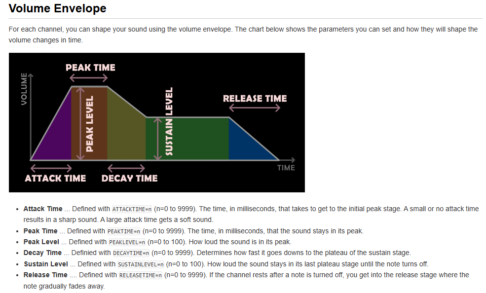

#Música Algorítmica 

##Clase 01 - 19/03/2026

Los algoritmos no tienen por qué ser instrucciones de computador, uno podría hacer música algorítmica lanzando dados o sacando cosas de un sombrero.

Música prescriptiva --> Se escribe la música y luego suena.

Música descriptiva --> Escribir en partitura música que ya existe.

Sean dice que la mitad de su tesis de magíster es un tutorial de SonicPi

En el barroco habían 3 formas de hacer música
○ Cantana --> para ser cantada
○ Sonata --> para ser sondada por los instrumentos de los músicos
○ Tocata --> Tocado en instrumentos con teclados

## Bibliografía

○ La composición algorítmica como un problema de satisfacción de restricciones. (Sean dice que entiende la mitad)

# BeepComp 

Si apretamos doc, iremos al documento donde se encuentra la referencia. 
BeepComp funciona solo con mayúsculas.

Lo primero es escribir @G (global), aquí se setea el tempo, volumen, delay, etc. Es como el void setup() de Arduino y Processing. Sean dice que apaguemos el delay.

V1 = 5 //PODEMOS CONTROLAR EL VOLUMEN DE CADA VOZ EN LA SECCIÓN GLOBAL


Sean dice que es raro para él que el sostenido y el bemol vayan antes de las notas en clave americana porque
es más músico.

Si el software no entiende algo del código, simplemente lo omite. Sean presentó una idea interesante, que 
consiste en ingresar un texto y descubrir qué tanto puede leer el código.

Sean dice que tengamos cuidado con utilizar los símbolos > y < para subir o bajar de octava, ya que como son relativos, en el contexto
de una repetición, el código subiría de octava en cada una de ellas.

La virgulilla (~), hace que la nota dure el doble de su duración, es como si ligáramos una figura musical con otra igual. No asociar
al punto.

se pueden repeti compases escribiendo llaves {}, esto hará que se repita una vez por defecto, pero si escribimos un numero después de 
la llave (ej: {3GBA}), se repetirá esa cantidad de veces.

### Primer compás de la melodía de zelda

```processing
@G

TEMPO=140
DELAY=OFF
LOOP=OFF
MASTERVOLUME=20

@1 //MELODIA

O4{ L8 F  A L4  B}//C1 (COMPAS)
L8 F  A  B O5 E D~ O4  B O5 C //C2
O4 B G E~~~ : D
```

Podemos seleccionar formas de onda!!

Debemos escribir en la voz que queremos modificar waveform = n

El tresillo se indica con corchetes cuadrados ([]), en verdad cualquier cantidad de notas que esté dentro de los corchetes calzará
dentro de la figura rítmica con la que estamos trabajando en el contexto de los corchetes.

# Código primer bloque

```processing
@G

TEMPO=140
DELAY=OFF
LOOP=OFF
MASTERVOLUME=20
V1=5 //5
V2=2 //2
V3=1 //1
V4=2 //2
D= 2

@1 //MELODIA
WAVEFORM=3
O4{ L8 F  A L4  B}//C1 (COMPAS)
L8 F  A  B O5 E D~ O4  B O5 C //C2
O4 B G E~~~ : D//C3
O4 L32 E~~ E L8 G E~~~ //C4 (CON APOYATURA )


@2 //BAJO 1

{{ O3 L8 F A A A}} //C1 Y 2
{{ O3 L8 E G G G }} //C3 Y 4

@3 //BAJO 2

{{{ O4 L8 : C C C}}} //C1, 2, 3 Y 4 
//TAMBIEN PODRIA HABERLO ESCRITO DE LA FORMA
//{8:CCC }

@D //BATERIA

L16 Khhh Shhh KhKh Shhh KhKh SKhK L8 K [HHH ] S:
PINKNOISE
NOISELEVEL=70
SNAREPITCH=20
KICKPITCH=30
L16 Khhh Shhh KhKh Shhh KhKh SKhK L8 K [HHH ] S:
```

## Cómo afectar la transiente (ADSR)



